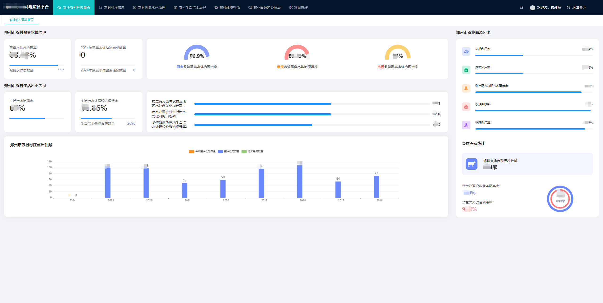
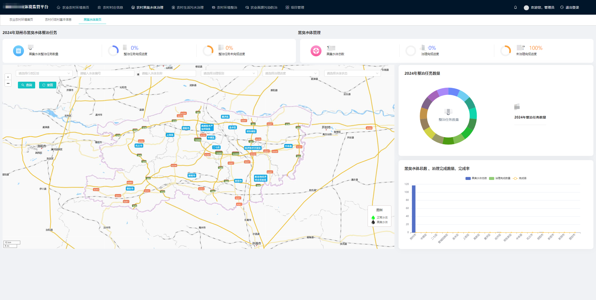
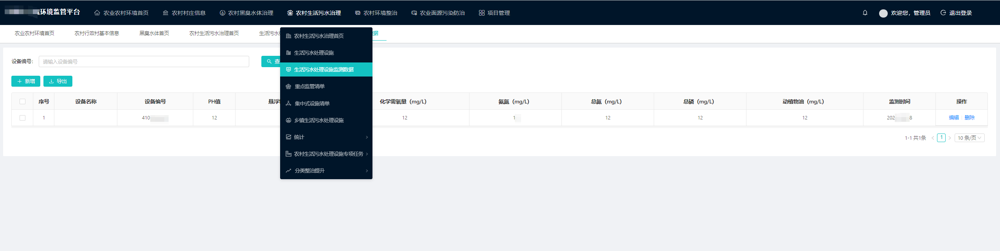

# 智慧环保-农业农村环境监管平台-数据大屏GIS看板硬件监控文档管理项目管理法律法规管理视频会议调度会商

#### 介绍
智慧环保农业农村环境监管平台

价格优惠，如需商务合作或软件定制开发请加微信：2609375767
#### 软件架构

软件架构说明

后端技术：Spring Boot 2.6.6 +MybatisPlus 3.5.1 + Shiro 1.8.0+ Jwt 3.11.0 
          + Swagger + Redis 

前端技术： Ant-design-vue + Vue

GIS框架：mapboxgl + leaflet + Cesium

其他技术： Druid（数据库连接池）、Logback（日志工具） 、poi（Excel工具）、
          Quartz（定时任务）、lombok（简化代码）

项目构建： Maven、Jdk8

#### 系统截图

